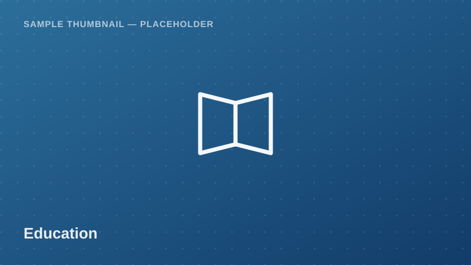

Education

School-level enrollment and completion indicators, including gender
parity, pupil-teacher ratio, and dropout rates — useful for education
access and quality research at the primary and secondary levels.

<a class="btn btn-accent" href="../request-access.html?dataset=Basic%20Education%20Statistics%20%E2%80%94%20School%20Enrollment%20and%20Completion%20Sample">
<i class="bi bi-send-fill me-1"></i> Request Access
</a>
<button class="btn btn-outline-secondary" disabled title="Pending approval — demo state">
<i class="bi bi-download me-1"></i> Download
</button>
Pending Approval (demo)

  <i class="bi bi-info-circle me-1"></i>
  <strong>Demo state:</strong> Download is disabled in this proof of concept.
  Real access control (auth + admin approval) is a Phase 2 backend feature.
  <!-- TODO: backend -->

## Dataset Details

::: {.dataset-meta-table}
|  |  |
|---|---|
| **Data Source / Provider** | President's Office – Regional Administration and Local Government (PO-RALG) — sample/demo attribution |
| **Year(s) Covered** | 2023 |
| **Geographic Coverage** | Mainland Tanzania, regional/school-level |
| **Sample Size** | 180 synthetic school-level records (demo) |
| **File Format** | CSV |
| **File Size** | 27 KB |
| **License / Terms of Use** | Academic / non-commercial research use with attribution (demo terms — see [Guidelines & FAQ](../guidelines.html)) |
:::

## Variables

- `school_id` — Unique school identifier
- `region` — Administrative region name
- `district` — Administrative district name
- `school_type` — Government / Private
- `enrollment_total` — Total pupil enrollment
- `enrollment_female_pct` — Share of enrollment that is female (%)
- `completion_rate_pct` — Primary/secondary completion rate (%)
- `pupil_teacher_ratio` — Pupils per teacher
- `dropout_rate_pct` — Annual dropout rate (%)

## Sample Data Preview

| school_id | region | school_type | enrollment_total | pupil_teacher_ratio | dropout_rate_pct |
|---|---|---|---|---|---|
| SCH-0011 | Morogoro | Government | 812 | 46 | 3.2 |
| SCH-0012 | Kilimanjaro | Government | 640 | 38 | 1.8 |
| SCH-0013 | Singida | Government | 505 | 52 | 4.6 |
| SCH-0014 | Pwani | Private | 390 | 22 | 0.9 |

<em>Preview rows are illustrative placeholder values, not real statistics.</em>

## Suggested Citation

> President's Office – Regional Administration and Local Government (PO-RALG). (2023). *Basic Education Statistics — School Enrollment and Completion Sample* [Data set]. Takwimu Bridge (demo portal). Retrieved 2026-07-29 from `https://example.org/datasets/basic-education-statistics`.

[← Back to Data Catalog](../catalog.html)
