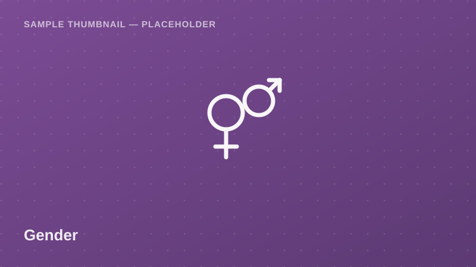

Gender

Self-reported prevalence indicators for physical and emotional violence,
incident reporting behavior, and awareness of support services — broken
down by age group and region. Sensitive-topic sample data for gender
studies coursework and research.

<a class="btn btn-accent" href="../request-access.html?dataset=Gender-Based%20Violence%20Prevalence%20Indicators%20Sample">
<i class="bi bi-send-fill me-1"></i> Request Access
</a>
<button class="btn btn-outline-secondary" disabled title="Pending approval — demo state">
<i class="bi bi-download me-1"></i> Download
</button>
Pending Approval (demo)

  <i class="bi bi-info-circle me-1"></i>
  <strong>Demo state:</strong> Download is disabled in this proof of concept.
  Given the sensitivity of this topic, production access would additionally
  require an ethics/IRB clearance upload — not yet implemented here.
  <!-- TODO: backend -->

## Dataset Details

::: {.dataset-meta-table}
|  |  |
|---|---|
| **Data Source / Provider** | Ministry of Health — TDHS Gender Module — sample/demo attribution |
| **Year(s) Covered** | 2022 |
| **Geographic Coverage** | National (Mainland Tanzania) |
| **Sample Size** | 200 synthetic respondent records, women aged 15–49 (demo) |
| **File Format** | CSV |
| **File Size** | 24 KB |
| **License / Terms of Use** | Academic / non-commercial research use with attribution; ethics review recommended (demo terms — see [Guidelines & FAQ](../guidelines.html)) |
:::

## Variables

- `respondent_id` — Unique respondent identifier
- `region` — Administrative region name
- `age_group` — 15–19 / 20–29 / 30–39 / 40–49
- `experienced_physical_violence_flag` — Self-reported experience (Yes/No)
- `experienced_emotional_violence_flag` — Self-reported experience (Yes/No)
- `reported_incident_flag` — Reported incident to authorities/services (Yes/No)
- `awareness_of_support_services` — Aware of local support services (Yes/No)

## Sample Data Preview

| respondent_id | region | age_group | experienced_physical_violence_flag | awareness_of_support_services |
|---|---|---|---|---|
| GBV-001 | Mara | 20–29 | No | Yes |
| GBV-002 | Tanga | 30–39 | Yes | No |
| GBV-003 | Dodoma | 15–19 | No | No |
| GBV-004 | Katavi | 40–49 | Yes | Yes |

<em>Preview rows are illustrative placeholder values, not real survey figures.</em>

## Suggested Citation

> Ministry of Health & National Bureau of Statistics (NBS). (2022). *Gender-Based Violence Prevalence Indicators Sample* [Data set]. Takwimu Bridge (demo portal). Retrieved 2026-07-29 from `https://example.org/datasets/gender-based-violence-indicators`.

[← Back to Data Catalog](../catalog.html)
