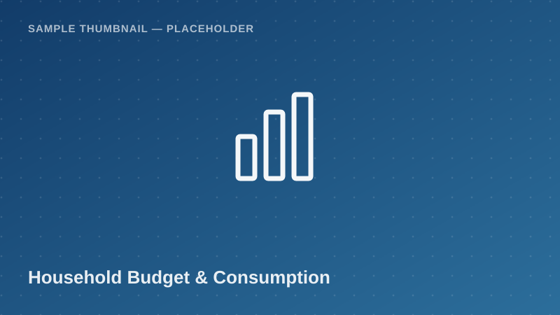

Household Budget / Income &amp; Consumption

Household-level consumption expenditure aggregates — food and non-food —
benchmarked against the national poverty line. A core input for poverty
analysis, welfare comparisons, and household economics coursework.

<a class="btn btn-accent" href="../request-access.html?dataset=Household%20Budget%20Survey%20(HBS)%20%E2%80%94%20Consumption%20Aggregates%20Sample">
<i class="bi bi-send-fill me-1"></i> Request Access
</a>
<button class="btn btn-outline-secondary" disabled title="Pending approval — demo state">
<i class="bi bi-download me-1"></i> Download
</button>
Pending Approval (demo)

  <i class="bi bi-info-circle me-1"></i>
  <strong>Demo state:</strong> Download is disabled in this proof of concept.
  Real access control (auth + admin approval) is a Phase 2 backend feature.
  <!-- TODO: backend -->

## Dataset Details

::: {.dataset-meta-table}
|  |  |
|---|---|
| **Data Source / Provider** | National Bureau of Statistics (NBS) — sample/demo attribution |
| **Year(s) Covered** | 2017/18 |
| **Geographic Coverage** | National (Mainland Tanzania), urban and rural strata |
| **Sample Size** | 300 synthetic household records (demo) |
| **File Format** | CSV |
| **File Size** | 58 KB |
| **License / Terms of Use** | Academic / non-commercial research use with attribution (demo terms — see [Guidelines & FAQ](../guidelines.html)) |
:::

## Variables

- `household_id` — Unique household identifier
- `region` — Administrative region name
- `urban_rural` — Classification: Urban / Rural
- `household_size` — Number of household members
- `monthly_food_expenditure_tzs` — Monthly food expenditure (TZS)
- `monthly_nonfood_expenditure_tzs` — Monthly non-food expenditure (TZS)
- `total_consumption_tzs` — Total monthly consumption expenditure (TZS)
- `poverty_line_tzs` — Applicable national poverty line (TZS)
- `below_poverty_line` — Flag: household below poverty line (Yes/No)

## Sample Data Preview

| household_id | region | urban_rural | total_consumption_tzs | poverty_line_tzs | below_poverty_line |
|---|---|---|---|---|---|
| HH-0001 | Mwanza | Urban | 412,000 | 49,320 | No |
| HH-0002 | Iringa | Rural | 138,500 | 33,748 | No |
| HH-0003 | Kigoma | Rural | 27,900 | 33,748 | Yes |
| HH-0004 | Tanga | Urban | 296,200 | 49,320 | No |

<em>Preview rows are illustrative placeholder values, not real survey figures.</em>

## Suggested Citation

> National Bureau of Statistics (NBS). (2018). *Household Budget Survey — Consumption Aggregates Sample* [Data set]. Takwimu Bridge (demo portal). Retrieved 2026-07-29 from `https://example.org/datasets/household-budget-survey-consumption`.

[← Back to Data Catalog](../catalog.html)
