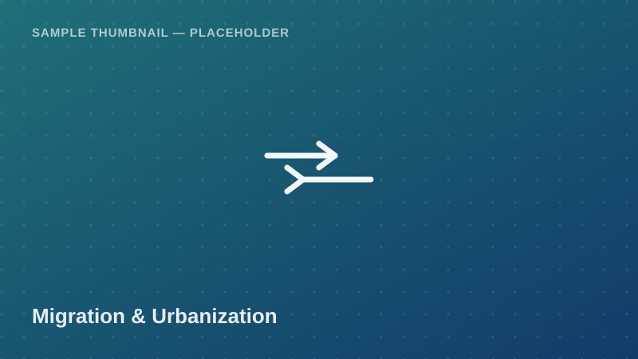

Migration &amp; Urbanization

Individual-level internal migration records capturing region of origin
and destination, reason for migrating, years since migration, and
post-migration employment status — useful for urbanization and
rural-urban migration research.

<a class="btn btn-accent" href="../request-access.html?dataset=Internal%20Migration%20and%20Urbanization%20Patterns%20Sample">
<i class="bi bi-send-fill me-1"></i> Request Access
</a>
<button class="btn btn-outline-secondary" disabled title="Pending approval — demo state">
<i class="bi bi-download me-1"></i> Download
</button>
Pending Approval (demo)

  <i class="bi bi-info-circle me-1"></i>
  <strong>Demo state:</strong> Download is disabled in this proof of concept.
  Real access control (auth + admin approval) is a Phase 2 backend feature.
  <!-- TODO: backend -->

## Dataset Details

::: {.dataset-meta-table}
|  |  |
|---|---|
| **Data Source / Provider** | NBS — Census Migration Module — sample/demo attribution |
| **Year(s) Covered** | 2021 |
| **Geographic Coverage** | National (Mainland Tanzania) |
| **Sample Size** | 175 synthetic individual migration records (demo) |
| **File Format** | CSV |
| **File Size** | 22 KB |
| **License / Terms of Use** | Academic / non-commercial research use with attribution (demo terms — see [Guidelines & FAQ](../guidelines.html)) |
:::

## Variables

- `respondent_id` — Unique respondent identifier
- `region_of_origin` — Region migrated from
- `region_of_residence` — Current region of residence
- `migration_reason` — Employment / Education / Family / Other
- `years_since_migration` — Years since relocating
- `urban_rural_destination` — Urban / Rural
- `employment_status_after_migration` — Employed / Unemployed / Not in labour force

## Sample Data Preview

| respondent_id | region_of_origin | region_of_residence | migration_reason | urban_rural_destination |
|---|---|---|---|---|
| M-0301 | Kigoma | Dar es Salaam | Employment | Urban |
| M-0302 | Singida | Arusha | Education | Urban |
| M-0303 | Lindi | Mtwara | Family | Rural |
| M-0304 | Geita | Mwanza | Employment | Urban |

<em>Preview rows are illustrative placeholder values, not real survey figures.</em>

## Suggested Citation

> National Bureau of Statistics (NBS). (2021). *Internal Migration and Urbanization Patterns Sample* [Data set]. Takwimu Bridge (demo portal). Retrieved 2026-07-29 from `https://example.org/datasets/internal-migration-urbanization`.

[← Back to Data Catalog](../catalog.html)
