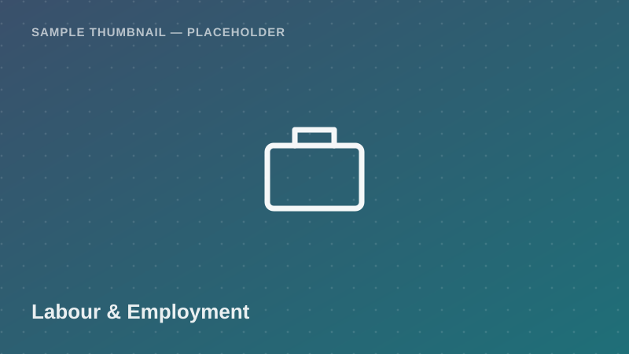

Labour &amp; Employment

Individual-level employment status, sector of work, informal employment
flag, and monthly income — with a focus on youth (ages 15–35). Useful for
labour market and youth transition research.

<a class="btn btn-accent" href="../request-access.html?dataset=Integrated%20Labour%20Force%20Survey%20(ILFS)%20%E2%80%94%20Youth%20Employment%20Sample">
<i class="bi bi-send-fill me-1"></i> Request Access
</a>
<button class="btn btn-outline-secondary" disabled title="Pending approval — demo state">
<i class="bi bi-download me-1"></i> Download
</button>
Pending Approval (demo)

  <i class="bi bi-info-circle me-1"></i>
  <strong>Demo state:</strong> Download is disabled in this proof of concept.
  Real access control (auth + admin approval) is a Phase 2 backend feature.
  <!-- TODO: backend -->

## Dataset Details

::: {.dataset-meta-table}
|  |  |
|---|---|
| **Data Source / Provider** | National Bureau of Statistics (NBS) — sample/demo attribution |
| **Year(s) Covered** | 2020/21 |
| **Geographic Coverage** | National (Mainland Tanzania), urban and rural |
| **Sample Size** | 260 synthetic individual records, ages 15–35 (demo) |
| **File Format** | CSV |
| **File Size** | 39 KB |
| **License / Terms of Use** | Academic / non-commercial research use with attribution (demo terms — see [Guidelines & FAQ](../guidelines.html)) |
:::

## Variables

- `respondent_id` — Unique respondent identifier
- `region` — Administrative region name
- `urban_rural` — Classification: Urban / Rural
- `age` — Respondent's age (years)
- `sex` — Male / Female
- `employment_status` — Employed / Unemployed / Not in labour force
- `sector` — Agriculture / Industry / Services
- `informal_employment_flag` — Works in the informal sector (Yes/No)
- `monthly_income_tzs` — Estimated monthly income (TZS)

## Sample Data Preview

| respondent_id | region | age | employment_status | sector | informal_employment_flag |
|---|---|---|---|---|---|
| R-0101 | Mbeya | 24 | Employed | Agriculture | Yes |
| R-0102 | Dar es Salaam | 29 | Employed | Services | No |
| R-0103 | Tabora | 19 | Unemployed | — | — |
| R-0104 | Ruvuma | 33 | Employed | Industry | Yes |

<em>Preview rows are illustrative placeholder values, not real survey figures.</em>

## Suggested Citation

> National Bureau of Statistics (NBS). (2021). *Integrated Labour Force Survey — Youth Employment Sample* [Data set]. Takwimu Bridge (demo portal). Retrieved 2026-07-29 from `https://example.org/datasets/labour-force-youth-employment`.

[← Back to Data Catalog](../catalog.html)
