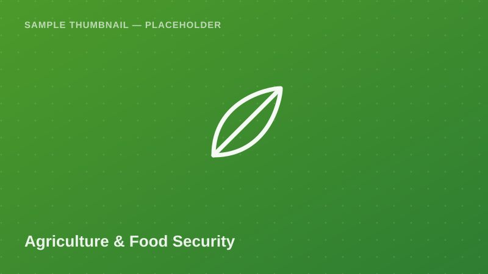

Agriculture &amp; Food Security

Farm-household level data on farm size, main crop, yield, input use (e.g.
improved seed), and a household food insecurity score. A staple dataset
for agricultural economics and rural livelihoods research.

<a class="btn btn-accent" href="../request-access.html?dataset=National%20Panel%20Survey%20(NPS)%20%E2%80%94%20Smallholder%20Agriculture%20Sample%20(Wave%205)">
<i class="bi bi-send-fill me-1"></i> Request Access
</a>
<button class="btn btn-outline-secondary" disabled title="Pending approval — demo state">
<i class="bi bi-download me-1"></i> Download
</button>
Pending Approval (demo)

  <i class="bi bi-info-circle me-1"></i>
  <strong>Demo state:</strong> Download is disabled in this proof of concept.
  Real access control (auth + admin approval) is a Phase 2 backend feature.
  <!-- TODO: backend -->

## Dataset Details

::: {.dataset-meta-table}
|  |  |
|---|---|
| **Data Source / Provider** | NBS / World Bank LSMS-ISA Program — sample/demo attribution |
| **Year(s) Covered** | 2019/20 (Wave 5) |
| **Geographic Coverage** | Rural Mainland Tanzania |
| **Sample Size** | 210 synthetic farm-household records (demo) |
| **File Format** | CSV |
| **File Size** | 31 KB |
| **License / Terms of Use** | Academic / non-commercial research use with attribution (demo terms — see [Guidelines & FAQ](../guidelines.html)) |
:::

## Variables

- `household_id` — Unique farm-household identifier
- `region` — Administrative region name
- `farm_size_acres` — Cultivated land area (acres)
- `main_crop` — Primary crop grown (e.g. maize, rice, cassava)
- `crop_yield_kg` — Estimated harvest yield (kg)
- `uses_improved_seed` — Uses improved/certified seed (Yes/No)
- `food_insecurity_score` — Household food insecurity score (0–10 scale)
- `access_to_extension_services` — Received agricultural extension services (Yes/No)

## Sample Data Preview

| household_id | region | main_crop | farm_size_acres | crop_yield_kg | food_insecurity_score |
|---|---|---|---|---|---|
| F-0201 | Iringa | Maize | 2.5 | 980 | 3 |
| F-0202 | Kigoma | Cassava | 1.2 | 640 | 6 |
| F-0203 | Manyara | Rice | 3.8 | 1,450 | 2 |
| F-0204 | Lindi | Maize | 1.0 | 410 | 7 |

<em>Preview rows are illustrative placeholder values, not real survey figures.</em>

## Suggested Citation

> National Bureau of Statistics (NBS) & World Bank LSMS-ISA. (2020). *National Panel Survey — Smallholder Agriculture Sample (Wave 5)* [Data set]. Takwimu Bridge (demo portal). Retrieved 2026-07-29 from `https://example.org/datasets/national-panel-survey-agriculture`.

[← Back to Data Catalog](../catalog.html)
