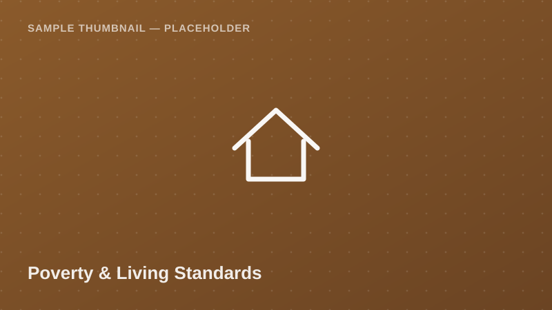

Poverty &amp; Living Standards

Small-area estimates of poverty headcount rate, extreme poverty rate, and
the Gini coefficient at the district level — produced using
small-area estimation techniques combining survey and census data.

<a class="btn btn-accent" href="../request-access.html?dataset=Poverty%20Mapping%20Dataset%20%E2%80%94%20District-Level%20Poverty%20Estimates%20Sample">
<i class="bi bi-send-fill me-1"></i> Request Access
</a>
<button class="btn btn-outline-secondary" disabled title="Pending approval — demo state">
<i class="bi bi-download me-1"></i> Download
</button>
Pending Approval (demo)

  <i class="bi bi-info-circle me-1"></i>
  <strong>Demo state:</strong> Download is disabled in this proof of concept.
  Real access control (auth + admin approval) is a Phase 2 backend feature.
  <!-- TODO: backend -->

## Dataset Details

::: {.dataset-meta-table}
|  |  |
|---|---|
| **Data Source / Provider** | NBS / World Bank Small Area Estimation Program — sample/demo attribution |
| **Year(s) Covered** | 2021 |
| **Geographic Coverage** | District-level, Mainland Tanzania |
| **Sample Size** | 139 synthetic district-level records (demo) |
| **File Format** | CSV |
| **File Size** | 19 KB |
| **License / Terms of Use** | Academic / non-commercial research use with attribution (demo terms — see [Guidelines & FAQ](../guidelines.html)) |
:::

## Variables

- `district` — District name
- `region` — Parent administrative region
- `poverty_headcount_rate_pct` — Share of population below the poverty line (%)
- `extreme_poverty_rate_pct` — Share of population below the food poverty line (%)
- `gini_coefficient` — Inequality index (0 = perfect equality, 1 = max inequality)
- `population_estimate` — Estimated district population
- `rural_urban_classification` — Predominantly Rural / Urban / Mixed

## Sample Data Preview

| district | region | poverty_headcount_rate_pct | gini_coefficient | rural_urban_classification |
|---|---|---|---|---|
| Kilosa | Morogoro | 31.4 | 0.38 | Mixed |
| Bukoba | Kagera | 24.7 | 0.35 | Mixed |
| Kinondoni | Dar es Salaam | 9.8 | 0.42 | Urban |
| Kondoa | Dodoma | 38.2 | 0.33 | Predominantly Rural |

<em>Preview rows are illustrative placeholder values, not real estimates.</em>

## Suggested Citation

> National Bureau of Statistics (NBS) & World Bank. (2021). *Poverty Mapping Dataset — District-Level Poverty Estimates Sample* [Data set]. Takwimu Bridge (demo portal). Retrieved 2026-07-29 from `https://example.org/datasets/poverty-mapping-district`.

[← Back to Data Catalog](../catalog.html)
