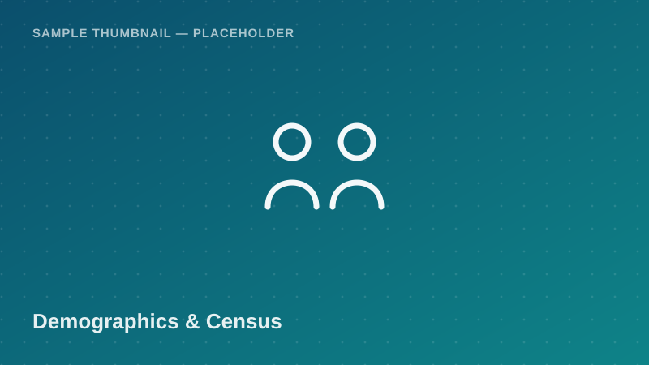

Demographics &amp; Census

A regional-level extract summarizing household composition, sex ratio,
dependency ratio, and literacy indicators from the national population and
housing census. Useful for demographic profiling, regional comparisons, and
as a baseline layer for socio-economic research.

<a class="btn btn-accent" href="../request-access.html?dataset=Tanzania%20Population%20and%20Housing%20Census%20Extract%20(Mainland%20Regions)">
<i class="bi bi-send-fill me-1"></i> Request Access
</a>
<button class="btn btn-outline-secondary" disabled title="Pending approval — demo state">
<i class="bi bi-download me-1"></i> Download
</button>
Pending Approval (demo)

  <i class="bi bi-info-circle me-1"></i>
  <strong>Demo state:</strong> this proof of concept has no real authentication or
  approval backend. The Download button is shown disabled in a simulated
  "Pending Approval" state. In production, it unlocks once an administrator
  approves your request. <!-- TODO: backend -->

## Dataset Details

::: {.dataset-meta-table}
|  |  |
|---|---|
| **Data Source / Provider** | National Bureau of Statistics (NBS) — sample/demo attribution |
| **Year(s) Covered** | 2022 |
| **Geographic Coverage** | Mainland Tanzania, all 26 regions |
| **Sample Size** | 250 synthetic regional/household records (demo) |
| **File Format** | CSV |
| **File Size** | 42 KB |
| **License / Terms of Use** | Academic / non-commercial research use with attribution (demo terms — see [Guidelines & FAQ](../guidelines.html)) |
:::

## Variables

- `region` — Administrative region name
- `district` — Administrative district name
- `ward` — Ward name
- `household_size` — Average persons per household
- `num_males` — Estimated male population count
- `num_females` — Estimated female population count
- `dependency_ratio` — Ratio of dependents to working-age population
- `literacy_rate_pct` — Adult literacy rate (%)
- `urban_rural` — Classification: Urban / Rural

## Sample Data Preview

| region | district | household_size | dependency_ratio | literacy_rate_pct | urban_rural |
|---|---|---|---|---|---|
| Dar es Salaam | Kinondoni | 4.1 | 0.78 | 94.2 | Urban |
| Arusha | Arusha City | 4.4 | 0.85 | 89.7 | Urban |
| Mbeya | Rungwe | 4.8 | 1.02 | 82.1 | Rural |
| Dodoma | Chamwino | 5.0 | 1.08 | 78.4 | Rural |

<em>Preview rows are illustrative placeholder values, not real census figures.</em>

## Suggested Citation

> National Bureau of Statistics (NBS). (2022). *Tanzania Population and Housing Census — Sample Extract* [Data set]. Takwimu Bridge (demo portal). Retrieved 2026-07-29 from `https://example.org/datasets/tanzania-population-census`.

[← Back to Data Catalog](../catalog.html)
