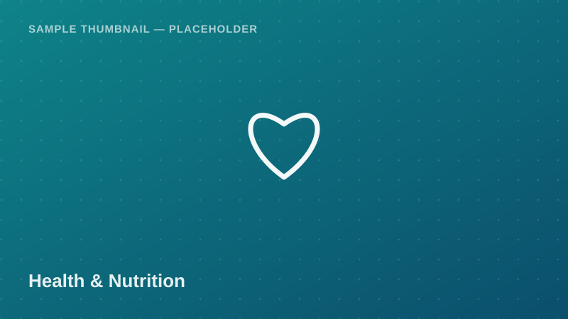

Health &amp; Nutrition

Child-level nutritional status indicators — stunting, wasting, and
underweight — alongside breastfeeding status and maternal education.
Commonly used for public health and nutrition policy research.

<a class="btn btn-accent" href="../request-access.html?dataset=Tanzania%20Demographic%20and%20Health%20Survey%20(TDHS)%20%E2%80%94%20Child%20Nutrition%20Indicators%20Sample">
<i class="bi bi-send-fill me-1"></i> Request Access
</a>
<button class="btn btn-outline-secondary" disabled title="Pending approval — demo state">
<i class="bi bi-download me-1"></i> Download
</button>
Pending Approval (demo)

  <i class="bi bi-info-circle me-1"></i>
  <strong>Demo state:</strong> Download is disabled in this proof of concept.
  Real access control (auth + admin approval) is a Phase 2 backend feature.
  <!-- TODO: backend -->

## Dataset Details

::: {.dataset-meta-table}
|  |  |
|---|---|
| **Data Source / Provider** | Ministry of Health, NBS & ICF (TDHS Program) — sample/demo attribution |
| **Year(s) Covered** | 2022 |
| **Geographic Coverage** | National (Mainland Tanzania and Zanzibar) |
| **Sample Size** | 220 synthetic child records, under-5 (demo) |
| **File Format** | CSV |
| **File Size** | 33 KB |
| **License / Terms of Use** | Academic / non-commercial research use with attribution (demo terms — see [Guidelines & FAQ](../guidelines.html)) |
:::

## Variables

- `child_id` — Unique child identifier
- `region` — Administrative region name
- `age_months` — Child's age in months
- `sex` — Male / Female
- `stunting_flag` — Height-for-age below -2 SD (Yes/No)
- `wasting_flag` — Weight-for-height below -2 SD (Yes/No)
- `underweight_flag` — Weight-for-age below -2 SD (Yes/No)
- `breastfeeding_status` — Exclusive / Mixed / None
- `mothers_education_level` — None / Primary / Secondary / Higher

## Sample Data Preview

| child_id | region | age_months | sex | stunting_flag | mothers_education_level |
|---|---|---|---|---|---|
| C-0001 | Njombe | 18 | Female | No | Secondary |
| C-0002 | Shinyanga | 34 | Male | Yes | Primary |
| C-0003 | Kagera | 9 | Female | No | None |
| C-0004 | Dar es Salaam | 47 | Male | No | Higher |

<em>Preview rows are illustrative placeholder values, not real survey figures.</em>

## Suggested Citation

> Ministry of Health, National Bureau of Statistics (NBS) & ICF. (2022). *Tanzania Demographic and Health Survey — Child Nutrition Indicators Sample* [Data set]. Takwimu Bridge (demo portal). Retrieved 2026-07-29 from `https://example.org/datasets/tdhs-child-nutrition`.

[← Back to Data Catalog](../catalog.html)
