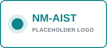

<!-- ============================= HERO ============================= -->
<section class="hero-section">

<i class="bi bi-mortarboard-fill me-1"></i> Proof of concept — for Tanzanian universities

<h1>Socio-economic data for your research — without months of fieldwork.</h1>

Takwimu Bridge <em>(placeholder name)</em> is a curated catalog of Tanzanian
socio-economic datasets. Browse a topic, request access, and download —
so students spend less time collecting data and more time analyzing it.

<a href="catalog.html" class="btn btn-accent btn-lg px-4">
<i class="bi bi-search me-1"></i> Browse Data
</a>
<a href="about.html" class="btn btn-outline-light btn-lg px-4">
Learn More
</a>

9

Sample Datasets

9

Topic Categories

5

Partner Universities*

*Placeholder partners shown for demonstration — see <a href="partners.html" class="link-light">For Universities</a>.

<i class="bi bi-bar-chart-line-fill" style="font-size:14rem;color:rgba(255,255,255,.12);"></i>

</section>

<!-- ======================= THE PROBLEM ======================= -->
<section class="section">

The Problem
<h2>Fieldwork is slow, costly, and often out of reach.</h2>

Many undergraduate and postgraduate research projects stall at the data
collection stage. Household surveys and enumeration take weeks, travel and
logistics strain student budgets, and small self-collected samples limit
how far a dissertation's analysis can go.

Meanwhile, high-quality socio-economic survey data already exists —
collected by national statistics agencies, research institutes, and
development partners — but it is scattered, hard to discover, and rarely
packaged for classroom or thesis use.

<i class="bi bi-hourglass-split step-icon"></i>

Weeks lost

to travel &amp; enumeration

<i class="bi bi-cash-coin step-icon"></i>

High cost

of independent fieldwork

<i class="bi bi-graph-down step-icon"></i>

Small samples

limit statistical power

<i class="bi bi-signpost-split step-icon"></i>

Hard to discover

existing quality datasets

</section>

<!-- ======================= HOW IT WORKS ======================= -->
<section class="section section-alt">

How It Works
<h2>From browsing to your dataset, in four steps</h2>

A simple, transparent workflow designed around how student research actually happens.

1

<h5><i class="bi bi-search me-1 text-accent"></i> Browse</h5>

Search and filter the catalog by topic, region, and year to find the dataset your research needs.

2

<h5><i class="bi bi-send-fill me-1 text-accent"></i> Request</h5>

Submit a short access request describing your research purpose and supervisor details.

3

<h5><i class="bi bi-check-circle-fill me-1 text-accent"></i> Get Approved</h5>

An administrator reviews the request and approves access under the dataset's usage terms.

4

<h5><i class="bi bi-download me-1 text-accent"></i> Download</h5>

Download the dataset and citation details, ready to bring into your analysis.

<i class="bi bi-info-circle me-1"></i>
In this proof of concept, steps 3–4 are demonstrated as mock states — see the
<a href="guidelines.html">Guidelines &amp; FAQ</a> page for what's real vs. simulated.

</section>

<!-- ======================= FEATURED DATASETS ======================= -->
<section class="section">

Featured
<h2 class="mb-0">A sample of the catalog</h2>

<a href="catalog.html" class="btn btn-outline-primary">
View Full Catalog <i class="bi bi-arrow-right ms-1"></i>
</a>

::: {#featured-datasets}
:::

</section>

<!-- ======================= PARTNER STRIP ======================= -->
<section class="section-tight section-alt">

Recognized By
<h4 class="mb-4 text-muted fw-normal">Partner universities <em>(placeholder logos for this demo)</em></h4>

Interested in official recognition for your institution? See
<a href="partners.html">For Universities &amp; Partners</a>.

</section>
